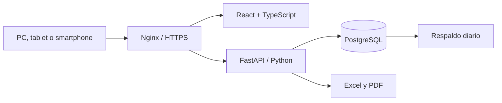

# Arquitectura técnica

La interfaz y la API se exponen bajo un mismo dominio. Nginx entrega la aplicación y dirige `/api`, `/docs` y `/openapi.json` a FastAPI. El backend concentra autenticación, permisos, reglas de calidad, firmas, reportes y auditoría. PostgreSQL 16 es la base obligatoria de operación; Alembic aplica el esquema antes de iniciar la API. SQLite se usa únicamente en pruebas automatizadas aisladas.

## Flujo de un registro

1. El inspector inicia el formulario y el sistema conserva la hora de inicio.
2. El frontend valida campos básicos y envía el payload a FastAPI.
3. El backend vuelve a validar obligatorios, consistencia, rangos y límites.
4. Se calcula conformidad, peso promedio o desviación según el módulo.
5. El registro queda pendiente y se notifica al coordinador.
6. El coordinador aprueba, observa o rechaza. La decisión genera código, firma HMAC y auditoría.
7. Dashboard y reportes incorporan el dato validado sin transcripción manual.

## Flujo de mejora continua

1. Una alerta de un registro puede originar automáticamente una no conformidad.
2. La no conformidad conserva módulo, lote, severidad, causa raíz y disposición.
3. La acción correctiva recorre Planificar, Hacer, Verificar y Actuar.
4. El responsable recibe una notificación y el sistema calcula vencimientos.
5. El cierre exige resultado de verificación y porcentaje de eficacia.
6. SPC reutiliza los valores numéricos registrados para cartas de control y capacidad.

## Roles

- Administrador: configuración, usuarios, maestros, módulos, reportes y auditoría.
- Coordinador: revisión, firma, indicadores, reportes y maestros.
- Inspector: captura y consulta operativa.
- Revisor: consulta y exportación sin capacidad de edición.
